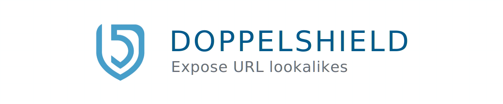

  

DoppelShield is a web application that protects users from homograph attacks and misleading URLs. It detects and exposes URLs that contain Cyrillic characters, which are often used by malicious actors to trick users into visiting deceptive websites.

  

    <h2 style="display: inline; float: right; width: calc(100% - 25px); margin: 0; position: relative; top: -0.085em;" id="table-of-contents">Table of Contents</h2>
  

  <nav style="clear: both; margin-top: 1rem">
    <ol type="I">
      <li><a href="#features">Features</a></li>
      <li><a href="#tools--technologies">Tools & Technologies</a></li>
      <li><a href="#getting-started">Getting Started</a></li>
      <li><a href="#usage">Usage</a>
      <li><a href="#license">License</a></li>
      <li><a href="#contact">Contact</a></li>
    </ol>
  </nav>

 

<h2 id="features">Features</h2>

- Detects Cyrillic characters in URLs
- Follows redirects to ensure the final destination URL is checked
- Provides warnings for URLs containing Cyrillic characters
- Checks URL validity and maximum number of redirects
- User-friendly interface for easy URL checking
- API endpoint for programmatic access

<h2 id="tools--technologies">Tools & Technologies</h2>

- React
- Next.js
- TypeScript
- CSS Modules
- Formspree (for contact form)

<h2 id="getting-started">Getting Started</h2>

To run the DoppelShield application locally, follow these steps:

1. Clone the repository.
2. Navigate to the project directory.
3. Install the dependencies.
4. Start the development server.
5. Open your browser and visit the specified URL to see the application running.

<h2 id="usage">Usage</h2>

6. On the homepage, enter a URL into the input field and click the "Check URL" button.
7. DoppelShield will expand the URL, follow any redirects, and check for the presence of Cyrillic characters.
8. The results will be displayed below the input field, indicating whether Cyrillic characters were found and any other relevant warnings.

<h2 id="license">License</h2>

This project is licensed under the <b><a href="https://opensource.org/licenses/mit">MIT License</a></b>. For more details regarding rights and limitations, see <a href="./LICENSE">LICENSE</a>.

<h2 id="contact">Contact</h2>

<h3>Joe Maalouf</h3>
<address style="display: flex; justify-content: flex-start; list-style-type: none;">
  
</address>

 

<a href="#top">Back to top ↑</a>
