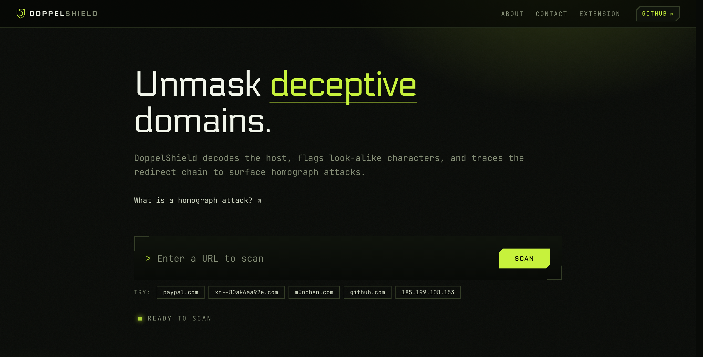
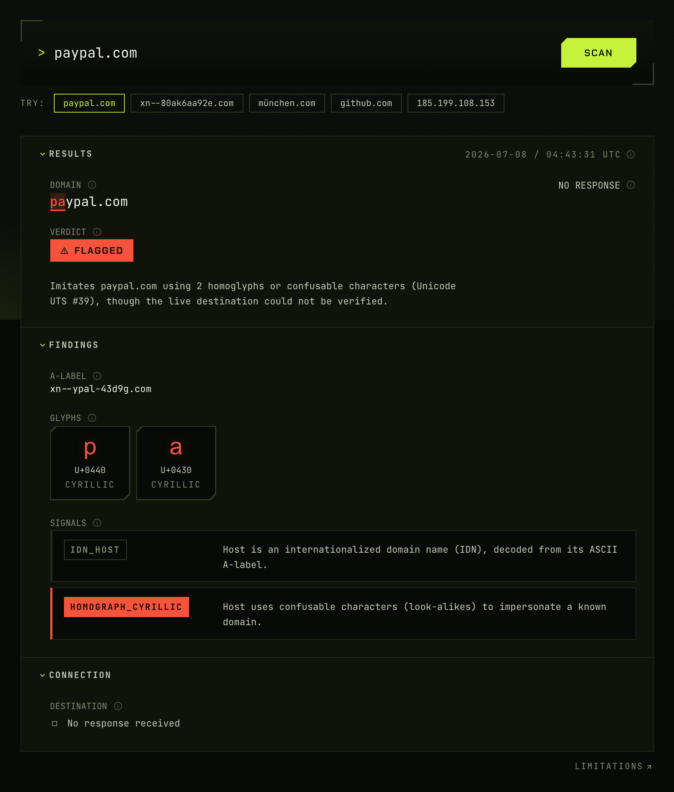
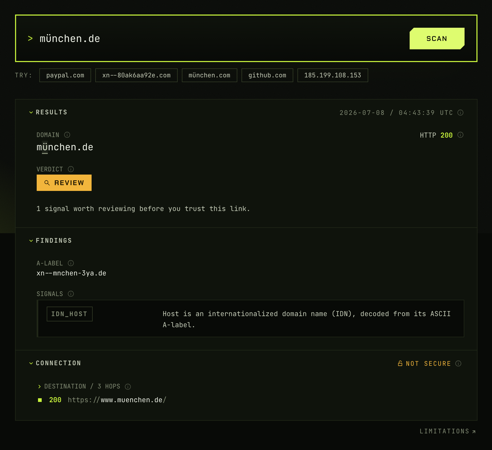
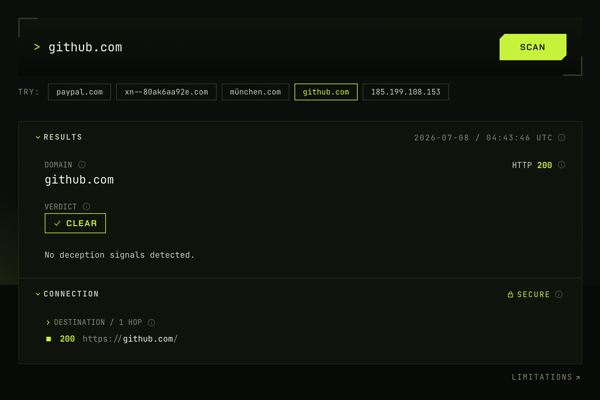
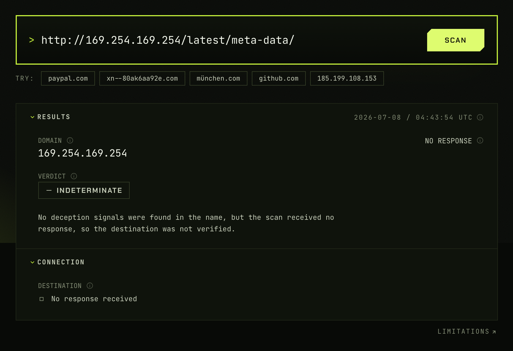

<section id="title">
  
</section>

<br />

<section id="badges" align="center">

[](https://developer.mozilla.org/en-US/observatory/analyze?host=doppelshield.com)&ensp;
[](https://www.ssllabs.com/ssltest/analyze.html?d=doppelshield.com)&ensp;
[](https://github.com/joelouf/doppelshield/actions/workflows/ci.yml)&ensp;
[](https://github.com/joelouf/doppelshield/actions/workflows/codeql.yml)&ensp;
[](./LICENSE)&ensp;

</section>

<hr />

<section align="center"><b><a href="https://doppelshield.com">Try it live → doppelshield.com</a></b></section>

<hr />
<br />

<section id="description">
  <p>DoppelShield is a URL forensics tool that detects homograph attacks, where a deceptive link uses visually similar characters from non-Latin scripts to impersonate a legitimate domain (for example a Cyrillic а standing in for a Latin a). Paste a link and it decodes the host, flags every look-alike character with its Unicode codepoint, script, and the Latin letter it imitates, and matches the destination against a large list of commonly impersonated brands. It then traces the redirect chain hop by hop and reports whether the destination responded.</p>

  <p>The fetching is a deliberately constrained server-side request primitive: outbound requests are guarded by connect-time SSRF defense in depth, and every failure collapses to one uniform outcome, so the endpoint cannot be turned into an internal-network oracle. The full design is written up as a threat model.</p>

  <p>DoppelShield ships as a web scanner and a JSON API, and deploys either on a serverless platform or as a self-contained Docker service, built on Next.js 16 and Node.js 24.</p>
</section>

<br />

<details open>
  <summary style="overflow: hidden; cursor: pointer;">
    <h2 style="display: inline;">&ensp;Table of Contents</h2>
  </summary>

  <nav style="margin-top: 0.6rem">
    <ul>
      <li><a href="#screenshots">Screenshots</a></li>
      <li><a href="#detection--scope">Detection & scope</a></li>
        <ul>
          <li><a href="#scope-and-non-goals">Scope and non-goals</a></li>
        </ul>
      <li><a href="#security">Security</a></li>
      <li><a href="#architecture">Architecture</a></li>
      <li><a href="#tech-stack">Tech stack</a></li>
      <li><a href="#getting-started">Getting Started</a></li>
      <li><a href="#usage">Usage</a></li>
        <ul>
          <li><a href="#web">Web</a></li>
          <li><a href="#api">API</a></li>
        </ul>
      <li><a href="#configuration">Configuration</a></li>
      <li><a href="#docker">Docker</a></li>
      <li><a href="#deployment">Deployment</a></li>
      <li><a href="#testing--ci">Testing & CI</a></li>
      <li><a href="#documentation">Documentation</a></li>
      <li><a href="#roadmap">Roadmap</a></li>
      <li><a href="#license">License</a></li>
        <ul>
          <li><a href="#data-attribution">Data Attribution</a></li>
        </ul>
      <li><a href="#contact">Contact</a></li>
        <ul>
          <li><a href="#joe-maalouf">Joe Maalouf</a></li>
        </ul>
    </ul>
  </nav>
</details>

<br />

<h2 id="screenshots">Screenshots</h2>

<p align="center"></p>

<p><b>Flagged look-alike</b>: A <code>paypal.com</code> impostor written with Cyrillic <code>р</code> (U+0440) and <code>а</code> (U+0430). The report decodes the host, shows its <code>xn--</code> A-label, and names each confusable glyph with its codepoint, script, and the Latin letter it imitates.</p>
<p align="center"></p>

<p><b>Benign internationalized domain</b>: A legitimate IDN, <code>münchen.de</code>. The decoded host is surfaced for inspection and the redirect chain is traced to its destination, but no impersonation signal is raised, so the verdict is REVIEW rather than a flag.</p>
<p align="center"></p>

<p><b>Clean pass</b>: No look-alike signals, and the redirect chain resolves in a single HTTPS hop. A clean result means no deception was detected in the name, not that the destination is safe.</p>
<p align="center"></p>

<p><b>Leak-free SSRF guard</b>: The cloud metadata endpoint (<code>169.254.169.254</code>) returns the same uniform no-response verdict as any unreachable host, so the scanner cannot be turned into an internal-network probe.</p>
<p align="center"></p>

<h2 id="detection--scope">Detection & scope</h2>

<ul>
  <li>Decodes the host from its IDNA `xn--` A-label back to Unicode before analysis.</li>
  <li>Flags homoglyphs across Cyrillic, Greek, and other confusable scripts, reporting each with its exact Unicode codepoint and script.</li>
  <li>Computes a Unicode UTS #39 style skeleton and matches it against a large list of commonly impersonated brands (roughly 3000 domains) to surface look-alikes.</li>
  <li>Follows redirects one hop at a time, each re-validated, with loop detection and a wall-clock deadline, and reports the full chain.</li>
</ul>

<h3 id="scope-and-non-goals">Scope and non-goals</h3>

A CLEAR verdict means no known look-alike signals were detected in the name, not that the destination is safe. Detection follows a curated confusables table spanning Cyrillic, Greek, and other scripts confusable with Latin, a subset of the full Unicode confusables set; pure-ASCII typosquats (for example `paypa1.com`) are out of scope, as are malware, phishing-content, and reputation verdicts. DoppelShield analyzes names and transport, and says so.

<h2 id="security">Security</h2>

DoppelShield is, by design, a server-side request primitive exposed to anonymous callers, so the engineering goal is to make that primitive useless for anything but its stated purpose. A CLEAR verdict means no look-alike signals were detected in the name, never that the destination is safe.

<ul>
  <li><b>SSRF defense in depth</b>: a scheme and port allowlist re-asserted at every redirect hop, resolve-all DNS checked against a denylist covering loopback, private, link-local, CGNAT, and cloud-metadata ranges, connect-time IP pinning that defeats DNS rebinding, a bounded walk, and a response body destroyed unread.</li>
  <li><b>Oracle resistance and timing floor</b>: every failure, whether a denylist hit, NXDOMAIN, refused connection, or timeout, collapses to one uniform <code>unreachable</code> outcome with <code>finalUrl</code> and <code>status</code> withheld, padded to a production minimum response time (<a href="./docs/adr/0001-uniform-ssrf-error-oracle.md">ADR-0001</a>).</li>
  <li><b>Abuse and availability</b>: an edge WAF rate rule, an in-process per-client limiter, a concurrency cap, and a capped streaming body read, cheapest rejection first.</li>
  <li><b>Browser surface</b>: a strict per-request CSP nonce with <code>strict-dynamic</code> and no <code>unsafe-inline</code> for scripts, plus HSTS, COOP, CORP, and a restrictive Permissions-Policy (<a href="./docs/adr/0003-strict-csp-via-nonce.md">ADR-0003</a>).</li>
  <li><b>Supply chain and runtime integrity</b>: SHA-pinned base images and Actions, a blocking Trivy release gate on fixable HIGH or CRITICAL findings, an SBOM with <code>mode=max</code> provenance and a Sigstore attestation, a digest-verified GHCR to ECR mirror, and a distroless non-root runtime with no shell or package manager.</li>
  <li><b>Cloud and IAM posture</b>: no IAM task role to steal, GitHub OIDC scoped to <code>v*</code> release tags with no long-lived keys, and service control policies enforced from a separate management account.</li>
</ul>

Each control cites its implementing file in the [threat model](./docs/threat-model.md). Vulnerability reporting and scanner exceptions are in [SECURITY.md](./SECURITY.md).

<h2 id="architecture">Architecture</h2>

DoppelShield splits into a framework-agnostic engine under `src/core/checkurl/` and a thin Next.js adapter, a ports-and-adapters design ([ADR-0004](./docs/adr/0004-framework-agnostic-checkurl-core.md)): the engine imports nothing from Next.js or React, speaks Web-standard `Request` and `Response`, and requires the Node.js runtime for SSRF-safe probing. The one injection seam is the `RateLimiter` interface, so a shared-store limiter drops in if the service ever scales horizontally. Request ordering is deliberate: rate limiting runs before the body is read, validation before the concurrency gate, and name analysis before the network walk, so rejection stays cheap and homograph findings survive an unreachable host. Production runs as a single ECS Fargate task behind an ALB and a WAF.

The component map, request-lifecycle and detection-pipeline diagrams, and the ADR index are in the [architecture overview](./docs/architecture.md).

<h2 id="tech-stack">Tech stack</h2>

<p><b>Application</b>: Next.js 16 (App Router), React 19, TypeScript, Node.js 24, Vitest, Docker (Next.js standalone output).</p>
<p><b>Security and infrastructure</b>: Terraform, AWS ECS Fargate with an ALB and WAF, GitHub Actions with OIDC, CodeQL, Trivy, Sigstore provenance, distroless runtime.</p>

<h2 id="getting-started">Getting Started</h2>

Requires Node.js 24 (see `.nvmrc`).

```bash
npm ci        # Install exact locked dependencies
npm run dev   # Start the dev server at http://localhost:3000
```

Common scripts:

```bash
npm run build       # Production build
npm start           # Run the production build
npm test            # Run the test suite
npm run typecheck   # tsc --noEmit
npm run lint        # Eslint
```

<h2 id="usage">Usage</h2>

<h3 id="web">Web</h3>

Open the app, enter a URL, and submit. DoppelShield decodes the host, traces redirects, and shows the verdict with per-character homoglyph evidence and the redirect chain.

<h3 id="api">API</h3>

```bash
curl -X POST http://localhost:3000/api/checkUrl \
  -H 'content-type: application/json' \
  -d '{"url":"https://example.com"}'
```

A response is a JSON `CheckResult`, for example:

```json
{
  "apiVersion": 1,
  "ok": true,
  "finalUrl": "https://example.com/",
  "status": 200,
  "redirectChain": [{ "url": "https://example.com/", "status": 200 }],
  "warnings": []
}
```

Failure modes return `ok: false` with a stable `error.code` (`invalid_input`, `rate_limited`, `unavailable`, or `unreachable`). Blocked and unreachable targets share the single `unreachable` code so the endpoint never reveals whether an internal host exists.

The full schema, warning codes, outcome matrix, and captured example transcripts are in the [API reference](./docs/api.md).

<h2 id="configuration">Configuration</h2>

All runtime configuration is via environment variables. Copy the template and adjust as needed:

```bash
cp .env.example .env
```

Two variables deserve attention before a public deploy:

- `NEXT_PUBLIC_SITE_URL` is inlined and prerendered at build time (sitemap, robots, canonical and OpenGraph tags). Set it for the build, not at runtime. For Docker, pass `--build-arg NEXT_PUBLIC_SITE_URL=https://your.domain`.
- `CHECKURL_TRUSTED_IP_HEADER` selects the header used to key per-client rate limiting. Behind a proxy or CDN, set it to a header your edge sets or appends: `x-forwarded-for` behind an AWS ALB (production; the limiter reads the rightmost, ALB-attested entry), `x-vercel-forwarded-for` on Vercel, `cf-connecting-ip` on Cloudflare, `x-real-ip` behind nginx. If it is left unset, all clients share one global rate-limit bucket, so a single visitor can rate-limit everyone.

Every tunable (timeouts, redirect and body limits, allowed ports, rate limits) is documented with its default, accepted bounds, and deployment guidance in the [configuration reference](./docs/configuration.md); `.env.example` lists the template values.

<h2 id="docker">Docker</h2>

```bash
docker build --build-arg NEXT_PUBLIC_SITE_URL=https://your.domain -t doppelshield .
docker run -p 3000:3000 doppelshield
```

The image is multi-stage: pinned Alpine build stages, and a distroless runtime that serves the Next.js standalone server as a non-root user with no shell or package manager on board ([ADR-0009](./docs/adr/0009-distroless-runtime-retires-undici-finding.md)).

<h2 id="deployment">Deployment</h2>

Production runs as a single container instance behind an edge proxy; the reasoning is recorded in [ADR-0007](./docs/adr/0007-single-instance-container-topology.md) and the operational procedures (release, deploy, verification, rollback, emergency platform switch) live in the [deployment runbook](./docs/runbook.md). The topology is realized on AWS as one ECS Fargate task behind an Application Load Balancer and a WAF rate rule scoped to the scan endpoint, defined in Terraform under [`infra/`](./infra/) and recorded in [ADR-0008](./docs/adr/0008-aws-ecs-fargate-lean-topology.md).

- Release artifact: version tags publish a scanned, attested image to GHCR that is mirrored by digest to ECR; deploy by digest on any OCI-compatible host. The supply-chain controls are summarized under [Security](#security).
- Health: orchestrator probes and the container HEALTHCHECK target `GET /api/health`, which sits outside the scan rate limiter and discloses nothing but a status field.
- Single instance: the rate limiter and concurrency cap are per process and held in memory. Behind multiple replicas the effective limits multiply, and a client can land on different instances. The edge applies the global rate limit; the in-process limiter is defense-in-depth. If horizontal scale is ever needed, a shared-store limiter slots in behind the existing `RateLimiter` interface.

<h2 id="testing--ci">Testing & CI</h2>

```bash
npm test                # Run all tests once
npm run test:coverage   # Run with coverage thresholds
```

The engine (`src/core/checkurl/`) carries enforced coverage thresholds (statements 85, lines 85, functions 70, branches 68) in `vitest.config.ts`, and security-sensitive paths (SSRF handling, the redirect walk, request handling) require accompanying tests. CI runs three jobs on every pull request: **verify** (format, lint, typecheck, tests with coverage, build, and `npm audit` at the moderate level), **infra** (`terraform fmt` and `validate` on both stacks), and **image** (a Docker build). CodeQL (security-extended) runs on push, pull request, and a weekly schedule, and release tags add a blocking Trivy image scan gate. The full gate list is in [CONTRIBUTING](./CONTRIBUTING.md).

<h2 id="documentation">Documentation</h2>

<ul>
  <li><a href="./docs/README.md">Documentation index</a>: map of all project documentation.</li>
  <li><a href="./docs/architecture.md">Architecture</a>: component map, request lifecycle, detection pipeline, deployment topology.</li>
  <li><a href="./docs/api.md">API reference</a>: full schema, outcome matrix, and captured response transcripts.</li>
  <li><a href="./docs/configuration.md">Configuration reference</a>: every tunable with defaults, bounds, and guidance.</li>
  <li><a href="./docs/threat-model.md">Threat model</a>: assets, trust boundaries, control mapping, residual risks.</li>
  <li><a href="./docs/runbook.md">Runbook</a>: release, deploy, verification, and rollback procedures.</li>
  <li><a href="./CONTRIBUTING.md">Contributing</a>: setup, quality gates, and conventions.</li>
</ul>

<h2 id="roadmap">Roadmap</h2>

<ul>
  <li><b>Browser extension</b>: Check the links you browse for homograph domains in place, without pasting manually.</li>
</ul>

<h2 id="license">License</h2>

<p>This project is licensed under the <a href="https://www.apache.org/licenses/LICENSE-2.0">Apache License, Version 2.0</a>. For the full terms, including the patent grant and redistribution conditions, see <a href="./LICENSE">LICENSE</a> and <a href="./NOTICE">NOTICE</a>.</p>

<h3 id="data-attribution">Data Attribution</h3>

The brand-target list is derived from the <a href="https://majestic.com/reports/majestic-million">Majestic Million</a>, licensed <a href="https://creativecommons.org/licenses/by/3.0/">CC BY 3.0</a>, or an equivalent public domain-popularity ranking, such as Tranco or Cisco Umbrella. See [NOTICE](./NOTICE) for full attribution.

<h2 id="contact">Contact</h2>

<h3 id="joe-maalouf">Joe Maalouf</h3>
<address style="display: flex; justify-content: flex-start; list-style-type: none;">
  <a href="https://github.com/joelouf" title="GitHub: @joelouf"></a>&ensp;<a href="https://www.npmjs.com/~joelouf" title="npm: ~joelouf"></a>&ensp;<a href="https://linkedin.com/in/joelouf" title="LinkedIn: /in/joelouf"></a>
</address>

<br />
<hr />

<p align="right"><a href="#title">Back to top ↑</a></p>
