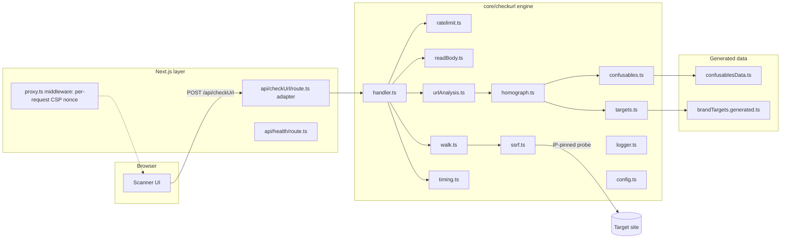
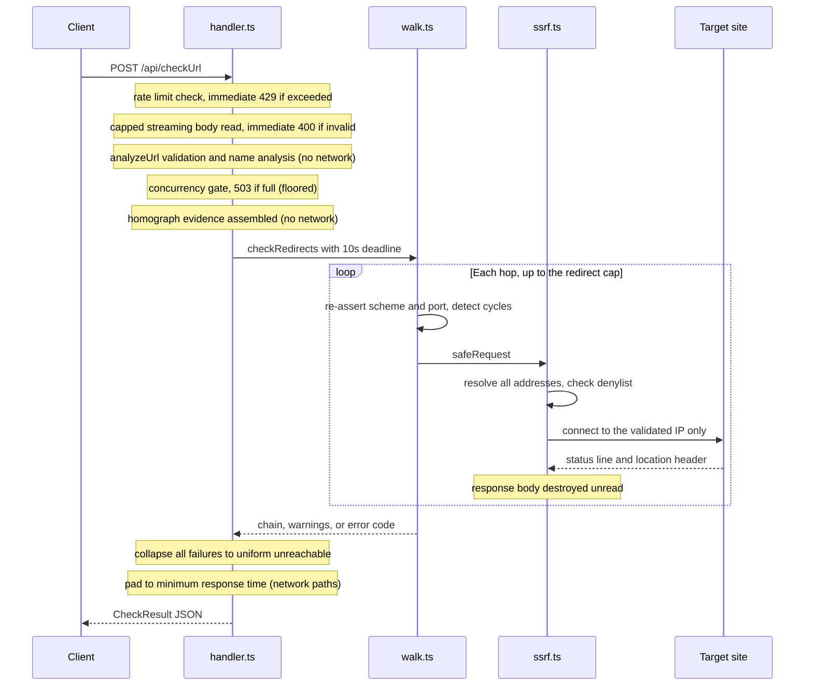
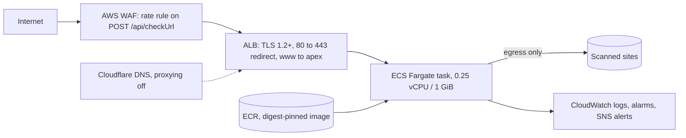

# Architecture

DoppelShield analyzes URLs for homograph impersonation and traces where they actually lead, without letting the analysis itself become an attack surface. This document maps the system: the framework-agnostic engine at its core, the thin web layer around it, and the AWS topology it ships to. Decision rationale lives in the [ADRs](adr/); operational procedures live in the [runbook](runbook.md).

Non-goals, stated deliberately: DoppelShield is not a malware scanner, not a reputation service, and does not claim a URL is safe. A clean result means no look-alike signals were detected in the name; the scope of every verdict is bounded by that sentence.

The [root README](../README.md#screenshots) shows how each verdict tier renders in the web UI.

## System shape

The engine in [src/core/checkurl/](../src/core/checkurl/) has no framework imports. It speaks Web-standard `Request` and `Response`, reads configuration from the environment once at import ([configuration reference](configuration.md)), and logs structured JSON lines to stdout. It does require the Node.js runtime: SSRF-safe probing is built on `node:http`, `node:https`, `node:dns`, and `node:net`, so the engine cannot run on an edge runtime.

## Ports and adapters

[ADR-0004](adr/0004-framework-agnostic-checkurl-core.md) split the endpoint into an engine and an adapter. The entire Next.js adapter is a few lines ([src/app/api/checkUrl/route.ts](../src/app/api/checkUrl/route.ts)): it exports `createCheckUrlHandler()` as `POST` and a shared `methodNotAllowed` for every other verb. Any fetch-style host (Express with an adapter, Hono, a bare Node server) mounts the same handler.

The one injection seam is `CheckUrlDeps` in [src/core/checkurl/handler.ts](../src/core/checkurl/handler.ts): a `rateLimiter` conforming to the `RateLimiter` interface ([src/core/checkurl/ratelimit.ts](../src/core/checkurl/ratelimit.ts)) can replace the default in-memory limiter with a shared store if the service ever scales horizontally. The interface accepts sync or async `check`, so a Redis-backed implementation drops in without touching the handler.

## Request lifecycle

Ordering is deliberate. The rate limiter runs before the body is read, so a rejected request costs almost nothing. Validation runs before the concurrency gate, so malformed requests never consume a scan slot. Name analysis runs before the walk, so homograph findings survive even when the host is unreachable. The exact outcome matrix, with captured examples, is in the [API reference](api.md).

## Detection pipeline

Name analysis ([src/core/checkurl/homograph.ts](../src/core/checkurl/homograph.ts)) runs entirely offline, on the decoded host:

1. **Decode.** An `xn--` A-label is decoded to Unicode (malformed punycode is tolerated, never fatal) and recorded as the informational `punycode_host` finding.
2. **Skeleton.** Each label is NFKC-normalized and mapped through a curated confusables table ([src/core/checkurl/data/confusablesData.ts](../src/core/checkurl/data/confusablesData.ts)) in the style of Unicode UTS #39, producing the text the label visually reads as. Characters without a mapping pass through unchanged, so the skeleton is ASCII only when every character maps.
3. **Brand match.** Skeletons are compared against roughly 3000 brand domains: 40 hand-curated seed targets plus a generated list derived from a public domain-popularity ranking ([src/core/checkurl/targets.ts](../src/core/checkurl/targets.ts), regenerated with `npm run gen:targets`). Labels whose skeleton equals the label itself are skipped, so pure-ASCII typosquats are explicitly out of scope; the engine detects visual confusability, not spelling distance.
4. **Script analysis.** A label written wholly in one non-Latin script whose skeleton reads as plausible Latin is flagged. The registrable label alone is exempt when its script is native to the TLD (Cyrillic under `.ru`, Greek under `.gr`, and so on, per [src/core/checkurl/tldScripts.ts](../src/core/checkurl/tldScripts.ts)); subdomain labels receive no such exemption. Mixed-script labels are flagged, with standard Japanese and Korean combinations exempt.
5. **Evidence.** Every non-ASCII codepoint is reported once with its script and, when the confusables table maps it, the Latin text it is confusable with ([src/core/checkurl/confusables.ts](../src/core/checkurl/confusables.ts)), so a reviewer can verify the finding character by character instead of trusting a label.

The three homograph findings are mutually exclusive by priority: target impersonation, then whole-script confusable, then mixed script. The [flagged-result screenshot](../README.md#screenshots) in the README shows this evidence rendered per glyph.

## Browser surface

Pages are served with a strict per-request Content Security Policy: [src/proxy.ts](../src/proxy.ts) mints a nonce for every HTML request and [src/lib/csp.ts](../src/lib/csp.ts) builds a `strict-dynamic` policy with no `unsafe-inline` for scripts ([ADR-0003](adr/0003-strict-csp-via-nonce.md)). API routes are excluded from the middleware and instead carry a static `default-src 'none'` policy from [next.config.ts](../next.config.ts), which also sets the site-wide headers (HSTS with preload, frame denial, referrer and permissions policies).

## Deployment topology

Production is a single Fargate task behind an internet-facing ALB with a regional WAF, defined entirely in [Terraform](../infra/) and recorded in [ADR-0008](adr/0008-aws-ecs-fargate-lean-topology.md). The load-bearing choices:

- The task runs the distroless image by digest, never by tag, with no IAM task role attached: a compromised container holds no cloud credentials ([ADR-0009](adr/0009-distroless-runtime-retires-undici-finding.md) covers the runtime).
- The task security group admits traffic only from the ALB security group by reference, so the origin cannot be reached directly even though it lives in a public subnet.
- The single-instance shape ([ADR-0007](adr/0007-single-instance-container-topology.md)) keeps the in-memory rate limiter and concurrency cap globally correct; the WAF provides the outer rate limit.
- Deploys roll through an ECS deployment circuit breaker with automatic rollback; both the ALB target group and the container health check probe `GET /api/health`.

Provisioning, first-apply bootstrapping, and the private-subnet upgrade seam are documented in [infra/README.md](../infra/README.md); release and rollback procedures are in the [runbook](runbook.md).

## Key decisions

| ADR                                                           | Decision                                                                                  |
| ------------------------------------------------------------- | ----------------------------------------------------------------------------------------- |
| [0001](adr/0001-uniform-ssrf-error-oracle.md)                 | Collapse all walk failures to one uniform response so the endpoint is not an SSRF oracle. |
| [0002](adr/0002-uts39-skeleton-homograph-detection.md)        | Detect homographs with a UTS #39 style skeleton plus per-glyph evidence.                  |
| [0003](adr/0003-strict-csp-via-nonce.md)                      | Strict CSP via a per-request nonce and strict-dynamic.                                    |
| [0004](adr/0004-framework-agnostic-checkurl-core.md)          | Framework-agnostic engine with a thin Next.js adapter.                                    |
| [0005](adr/0005-warnings-based-report.md)                     | Categorical warnings instead of a numeric risk score.                                     |
| [0006](adr/0006-verdict-hue-triad.md)                         | Verdict tones map to a safe, caution, danger, neutral hue system.                         |
| [0007](adr/0007-single-instance-container-topology.md)        | Single container instance behind an edge.                                                 |
| [0008](adr/0008-aws-ecs-fargate-lean-topology.md)             | Realize that topology as ECS on Fargate behind ALB and WAF.                               |
| [0009](adr/0009-distroless-runtime-retires-undici-finding.md) | Distroless runtime; retires the npm-vendored undici finding via OpenVEX.                  |

## Security posture

The security design is documented as a standalone [threat model](threat-model.md): assets, trust boundaries, attacker capabilities, the control mapping for SSRF defense in depth and oracle resistance, supply-chain integrity from build to deploy, and the residual risks that are accepted rather than hidden.
