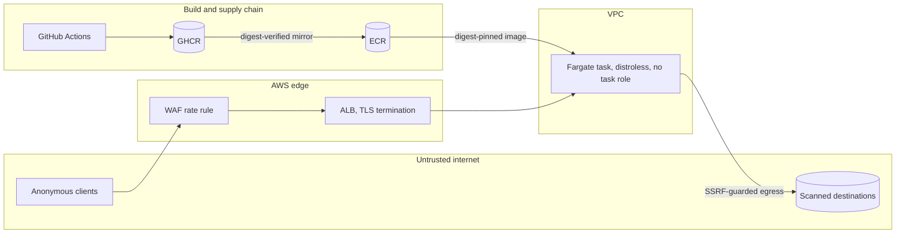

# Threat model

DoppelShield fetches attacker-supplied URLs from inside its own infrastructure. That sentence is the threat model's starting point: the product is, by design, a server-side request primitive exposed to anonymous users, so the design problem is making that primitive useless for anything except its stated purpose. This document records the assets, trust boundaries, attacker capabilities, the controls mapped to source, and the residual risks that are accepted rather than hidden.

Method: an informal, STRIDE-flavored working document, maintained alongside the code. It is not a compliance artifact. Every control cites the file that implements it.

## Assets

| Asset                            | Why it matters                                                                                                                       |
| -------------------------------- | ------------------------------------------------------------------------------------------------------------------------------------ |
| The outbound request capability  | An anonymous caller can make this service issue HTTP requests. Unconstrained, that is an SSRF proxy and an internal network scanner. |
| Reachability information         | Even without a proxied response, "did that address answer" is valuable reconnaissance about private networks.                        |
| Cloud credentials and metadata   | The classic SSRF escalation path. Deliberately absent: the task has no IAM task role to steal.                                       |
| Availability                     | A single small task serves the site; scan slots and sockets are finite.                                                              |
| Verdict integrity and user trust | A user acting on a wrong or overclaimed verdict is the product-level failure. Verdicts never claim more than name analysis supports. |
| Build-to-runtime integrity       | The image runs with network egress; a tampered image is a tampered scanner.                                                          |

## Trust boundaries

Boundary crossings that matter: anonymous input crossing into the application (request body and headers), the application crossing out to attacker-controlled destinations (the walk), and the image crossing from public registry to production runtime.

## Attacker capabilities

| Attacker                   | Capabilities assumed                                                                                               |
| -------------------------- | ------------------------------------------------------------------------------------------------------------------ |
| Anonymous API client       | Sends arbitrary URLs, malformed bodies, forged headers, and unlimited request volume from many source IPs.         |
| Malicious destination      | Controls DNS answers (including rebinding), redirect chains, response timing, ports, and schemes on its own hosts. |
| Timing analyst             | Measures response latency to infer what the uniform response body withholds.                                       |
| Browser-side attacker      | Attempts script injection against the web UI.                                                                      |
| Supply-chain attacker      | Attempts to alter the image between build and deploy, or to ride in via a compromised dependency or base image.    |
| Post-exploitation attacker | Is assumed to have achieved code execution inside the container; the question is what that position is worth.      |

## Controls

### SSRF defense in depth

The walk assumes the destination is hostile at every hop ([src/core/checkurl/walk.ts](../src/core/checkurl/walk.ts), [src/core/checkurl/ssrf.ts](../src/core/checkurl/ssrf.ts)):

1. **Scheme and port allowlist, re-asserted per hop.** Only `http:` and `https:` on ports 80 and 443 (by default) are ever contacted; a redirect to another scheme or port aborts the walk (`assertSchemeAndPortAllowed`).
2. **Resolve-all DNS with a denylist.** Every A and AAAA record is resolved and checked against a `net.BlockList` covering loopback, RFC 1918, link-local and cloud metadata, CGNAT, benchmarking, documentation, multicast, and reserved ranges, with IPv6 equivalents including ULA, NAT64, and 6to4. If any resolved address is blocked, no socket is opened (`ssrfSafeLookup`). The address validator fails closed: non-IP, empty, or family-mismatched values are treated as blocked (`isBlockedAddress`).
3. **Connect-time IP pinning.** The connection is made to the literal validated IP with the DNS family pinned, while the original hostname travels in the `Host` header and TLS SNI. Node performs no second lookup, so a rebinding attacker cannot swap in a private address between check and connect (`safeRequest`).
4. **Bounded walk.** Manual redirect following with a hop cap, cycle detection, per-hop timeout, a URL length cap re-applied to every redirect target, and a wall-clock deadline for the whole walk enforced by an `AbortController` in [src/core/checkurl/handler.ts](../src/core/checkurl/handler.ts).
5. **Minimal consumption.** Only the status line and `Location` header are read; the response body is destroyed unread, so the service cannot be used to exfiltrate or relay content.
6. **Nothing worth stealing.** The task definition attaches no IAM task role ([infra/ecs.tf](../infra/ecs.tf), [infra/iam.tf](../infra/iam.tf)). Even a hypothetical bypass reaching the metadata service finds no task credentials, removing the standard SSRF-to-cloud-account escalation as a category.

### Oracle resistance

Blocking requests is not enough; the endpoint must not reveal what it blocked ([ADR-0001](adr/0001-uniform-ssrf-error-oracle.md)):

- **Uniform failure.** Every walk failure, whether an SSRF denylist hit, NXDOMAIN, refused connection, or timeout, collapses to one public outcome: `error.code: "unreachable"`, one fixed message, HTTP 200, with `finalUrl` and `status` withheld ([src/core/checkurl/handler.ts](../src/core/checkurl/handler.ts)). A probe of `http://169.254.169.254/` and a probe of a nonexistent domain return byte-identical error objects; the [API reference](api.md) shows the captured transcript.
- **Timing floor.** Outcomes that touch the network, plus the busy 503, are padded to a minimum response time, 500 ms in production ([src/core/checkurl/timing.ts](../src/core/checkurl/timing.ts), `CHECKURL_MIN_RESPONSE_MS`). The pad is a floor, not a normalizer: a denylist hit that fails in a millisecond and a nonexistent domain present identical latency, while a probe that runs to its connection timeout remains slower. What matters for the oracle is that denylisted targets fail before any connection attempt, so their timing never depends on the target's behavior. The 400 and 429 paths return immediately; they are decided before any network activity, so their latency carries no reachability signal.
- **Internally observable, externally silent.** Blocked probes are logged as structured `ssrf_blocked` events with a request ID ([src/core/checkurl/logger.ts](../src/core/checkurl/logger.ts)), and a CloudWatch metric filter turns them into a `DoppelShield/SsrfBlocked` metric with a spike alarm ([infra/observability.tf](../infra/observability.tf)). Detection happens on the operator's side of the boundary, not the caller's.

### Abuse and availability

Layered, cheapest rejection first:

| Layer       | Control                                                                                                                                                                                                                                                                                                                                                                                                                                                              |
| ----------- | -------------------------------------------------------------------------------------------------------------------------------------------------------------------------------------------------------------------------------------------------------------------------------------------------------------------------------------------------------------------------------------------------------------------------------------------------------------------- |
| Edge        | WAF rate rule scoped to `POST /api/checkUrl`, 100 requests per 60 s per source IP, aggregated on the TCP source address so it cannot be reset via forged headers ([infra/waf.tf](../infra/waf.tf)).                                                                                                                                                                                                                                                                  |
| Application | In-process fixed-window limiter, 20 per 60 s per client key, keyed by the rightmost hop of the ALB-appended `x-forwarded-for` so clients cannot choose their own bucket ([src/core/checkurl/handler.ts](../src/core/checkurl/handler.ts), [configuration reference](configuration.md)). Bounded at 10000 tracked keys with soonest-reset eviction so the key table itself cannot be ballooned ([src/core/checkurl/ratelimit.ts](../src/core/checkurl/ratelimit.ts)). |
| Admission   | A concurrency cap returns 503 before a request can claim walk resources; rate limiting and validation run before the cap so malformed traffic never occupies a slot.                                                                                                                                                                                                                                                                                                 |
| Input       | The request body is read as a stream against a byte cap and a read timeout; `Content-Length` is not trusted ([src/core/checkurl/readBody.ts](../src/core/checkurl/readBody.ts)). URL length is capped on input and per redirect target.                                                                                                                                                                                                                              |
| Outbound    | Each shared agent (HTTP and HTTPS) caps outbound sockets per destination host and per agent in total; per-hop timeouts and the walk deadline bound how long a slow destination can hold resources.                                                                                                                                                                                                                                                                   |

The two rate-limit layers are deliberately spaced about five times apart so the application limiter, which understands client identity, stays the precise enforcer, and the WAF absorbs floods ([infra/variables.tf](../infra/variables.tf)).

### Browser surface

- Per-request CSP nonce with `strict-dynamic` and no `unsafe-inline` for scripts ([src/proxy.ts](../src/proxy.ts), [src/lib/csp.ts](../src/lib/csp.ts), [ADR-0003](adr/0003-strict-csp-via-nonce.md)).
- API responses carry `default-src 'none'`, `no-store`, `nosniff`, frame denial, and `no-referrer`; site-wide headers add HSTS with preload, COOP, CORP, and a restrictive Permissions-Policy ([next.config.ts](../next.config.ts)).
- Confusable strings returned by the API are data, not markup; the UI renders them as text with per-glyph evidence rather than interpreting them.

### Supply chain and runtime

The chain from source to running task, in order ([.github/workflows/release.yml](../.github/workflows/release.yml), [Dockerfile](../Dockerfile)):

1. Build stages run on a SHA-pinned `node:24-alpine`; all GitHub Actions are SHA-pinned; Dependabot watches npm, Actions, and the Docker base images.
2. Trivy scans every release candidate twice: a full report uploaded to code scanning, and a blocking gate that fails the release on fixable HIGH or CRITICAL findings.
3. The image is pushed to GHCR with an SBOM and `mode=max` provenance, and a Sigstore build-provenance attestation is pushed to the registry.
4. A separate job assumes an AWS role via GitHub OIDC, restricted to this repository's `v*` tags with no long-lived keys ([infra/iam.tf](../infra/iam.tf)), mirrors the image to ECR by digest, and fails unless the mirrored manifest digest is byte-identical.
5. Terraform deploys the image by digest, never by tag, into an ECR repository with immutable tags ([infra/ecr.tf](../infra/ecr.tf)); the ECS circuit breaker rolls back a deployment that cannot become healthy.
6. The runtime base is distroless (`nonroot` variant, UID 65532): no shell, no package manager, no npm ([ADR-0009](adr/0009-distroless-runtime-retires-undici-finding.md)). A post-exploitation attacker lands in a container with no tooling and no credentials.
7. Known-irrelevant base-image findings are recorded as machine-readable OpenVEX statements ([security/vex/](../security/vex/)) with the retirement condition stated, instead of being silenced in scanner config.

### Cloud posture

- The task security group admits port 3000 only from the ALB security group by reference; the ALB egresses only to the task ([infra/alb.tf](../infra/alb.tf)). The origin is unreachable directly even though the task runs in a public subnet.
- Detective controls alert by email via SNS: SSRF-block spikes, ALB 5xx, unhealthy target, and anomalous log ingestion ([infra/observability.tf](../infra/observability.tf)); monthly and daily budgets alert on the cost of any abuse that slips through; the preventive cost control is the service control policy denial of expensive services below.
- A separate management account applies service control policies (region lock, denial of expensive services, CloudTrail tamper protection, and denial of new IAM users, access keys, and login profiles) that a compromise of the production account cannot edit ([infra/management/](../infra/management/)).

## Residual risks and accepted trade-offs

Recorded deliberately; each is a decision, not an oversight.

| Risk                                                    | Assessment                                                                                                                                                                                                                     |
| ------------------------------------------------------- | ------------------------------------------------------------------------------------------------------------------------------------------------------------------------------------------------------------------------------ |
| Reachability of public sites is disclosed by design     | The product exists to report whether a URL responds. Oracle uniformity protects blocked and internal targets specifically; it does not, and cannot, hide public reachability.                                                  |
| In-memory rate limiter is per process                   | Correct at the deliberate single-instance topology ([ADR-0007](adr/0007-single-instance-container-topology.md)). Horizontal scale multiplies effective limits until a shared-store `RateLimiter` is injected.                  |
| WAF aggregates on TCP source                            | Clients behind one NAT share the edge budget. Acceptable because the application layer keys on the per-client header, and the edge exists to stop floods, not to be fair.                                                      |
| Task runs in a public subnet with a public egress IP    | Inbound is closed by security group. The private-subnet-plus-NAT upgrade is an additive seam documented in [infra/README.md](../infra/README.md) and [ADR-0008](adr/0008-aws-ecs-fargate-lean-topology.md).                    |
| Unset trusted header degrades to one global rate bucket | Fails safe for SSRF but poorly for availability. Production sets it; the handler logs `checkurl_rate_limit_degraded` at startup so the state is visible.                                                                       |
| Detection scope is a curated confusables subset         | Homograph coverage follows the curated table and script list; pure-ASCII typosquats (`paypa1.com`) are out of scope by design ([ADR-0002](adr/0002-uts39-skeleton-homograph-detection.md)). The UI and README state the scope. |
| No ALB access logs; container insights disabled         | Cost-driven. Observability rests on ALB metrics, the structured app log, and the alarms above; the gap is acknowledged.                                                                                                        |
| Availability of a single task                           | An accepted trade-off of the lean topology; the circuit breaker and health probes bound downtime, they do not eliminate it.                                                                                                    |

## Out of scope

- Malware, phishing-content, and reputation verdicts: DoppelShield analyzes names and transport, and says so.
- Volumetric DDoS beyond the WAF and rate limits.
- Compromise of the GitHub account or repository itself; mitigations (OIDC scoped to tags, SHA-pinned actions, branch history) reduce but do not remove this.
- Physical and AWS-internal threats below the shared-responsibility line.
